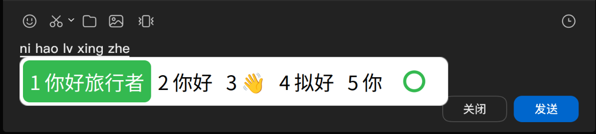
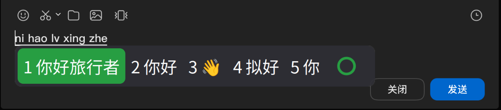
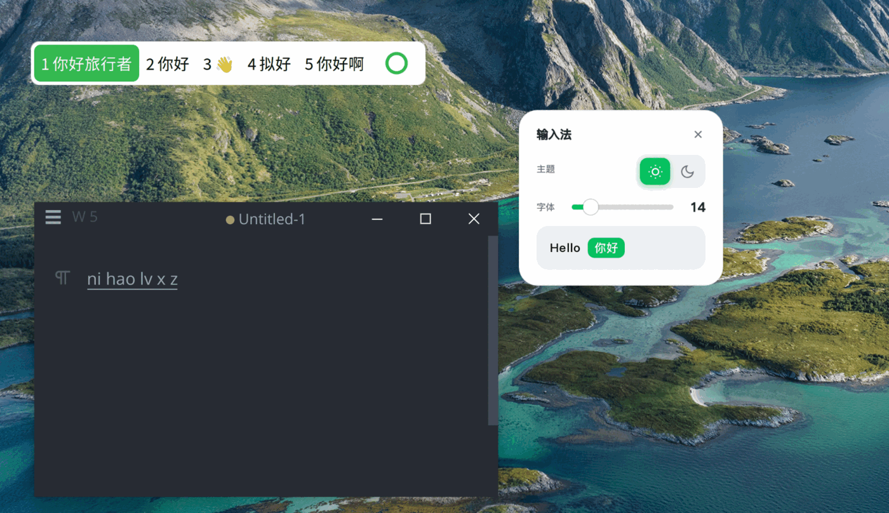
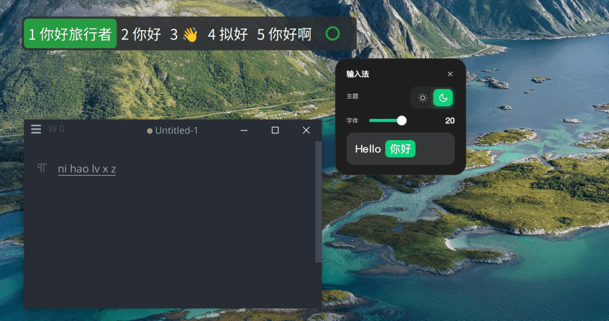

# Fcitx5 WeChat Theme

WeChat-style input method for [Fcitx5](https://github.com/fcitx/fcitx5), with
**patch modules** (candidate-window gear button, tray icon/menu), **Web settings
panel** (transparent rounded card), a rime-ice layout, and a one-click install
script validated in Docker.

 

 

> **How to read the previews:** the top row is the **candidate window** in the
> light / dark theme — the green ring at the bottom-right is the settings
> button, and hovering it shows a light-blue backdrop. The bottom row is the
> **settings panel** opened by that button: a transparent rounded always-on-top
> card you can drag by its title bar, with a font-size slider and light/dark
> theme cards. Every change applies instantly — no fcitx5 restart needed.

> **⚠️ Before you start — know the two ways to use this theme.**
>
> - **Just want to try it** (no tweaking): run the install commands below and it works out of the box.
> - **Want pixel-perfect results after changing the font size / margins**: this theme uses **SVG-based highlight blocks**. The SVGs are tuned for **14px text** (see [Customization](#customization-diy)); if you bump the system font size without adjusting the SVG `rx`/margins, the highlight roundness breaks. Beginners should treat the shipped defaults as the recommended baseline and only tweak via the guide below.

## New in this branch

- **Candidate-window gear button** (classicui patch): a green ring button at the
  bottom-right of the candidate window; click it to open the **Web settings
  panel** (font size / light-dark theme). Hover shows a light-blue rounded
  backdrop. Right-click the candidate window for a quick menu.
- **Theme / font changes apply instantly** (classicui patch): the candidate
  window watches `~/.config/fcitx5/conf/classicui.conf` and repaints on change —
  no `fcitx5 -r` needed.
- **Custom tray icon** (notificationitem patch): fixed `fcitx-wusong` icon
  (green rounded square + sprout), sent as real pixmap data; tray menu is
  reduced to **Preference** (opens the settings panel) + **Restart**.
- **Web settings panel** (`wechat-panel/`): pywebview + QtWebEngine, fully
  transparent rounded card pinned on top (WeChat-style), slider font size,
  light/dark theme cards with preview, instant apply, single-instance wake-up,
  drag by the title bar.
- **One-click installer** `install-new.sh` for a clean Ubuntu/Debian x86_64:
  deploys the prebuilt SVG fcitx5 + patch modules, themes, rime-ice (keeps your
  existing rime userdb/build), tray icon, panel autostart — and **never deletes
  user data**; every overwritten system file is backed up to
  `/root/fcitx5-backup-<ts>/`. Validated in an Ubuntu 26.04 Docker container.

## Requirements

SVG rendering needs fcitx5 classicui built with librsvg:

- fcitx5 **>= 5.1.22** (distro builds here).
- Ubuntu 26.04 ships fcitx5 **5.1.19** without SVG support — the tar.gz bundles
  a self-built 5.1.22 with the patches, see [Installation](#installation).

## Installation

### One-click install (recommended) — `install-new.sh`

Download the latest **Source code** zip/tar.gz from the
[Releases](https://github.com/OrangeAreFruit/Fcitx5-Wechat-Theme/releases) page
(it bundles every asset — no git needed), or `git clone` this repo. Then from
the repo root:

```bash
sudo bash install-new.sh
```

The script (idempotent, no user data removed):

1. Installs missing system libraries (librsvg, xcb, librime, …).
2. Deploys the bundled prebuilt **SVG fcitx5 5.1.22** from `packages/`
   (includes the classicui + notificationitem patches).
3. Installs `wechat-light` / `wechat-dark` themes (user-level).
4. Installs the **rime-ice (雾凇拼音)** dictionary — keeps existing `userdb/`,
   `build/`, user configs; only backs up overwritten files.
5. Configures fcitx5: Rime enabled, Chinese by default, `Theme=wechat-light`.
6. Installs the Web settings panel to `/opt/fcitx5-wechat-panel` (+ autostart).
7. Installs the custom tray icon + autostart entries.
8. Restarts fcitx5.

Log out & back in once so the input-method environment variables take effect.

> **Where the panel lives:** the panel is installed to `/opt/fcitx5-wechat-panel`.
> Because the prebuilt patch modules launch it via `$HOME/fcitx5-wechat-panel/run-panel.sh`
> (gear button & tray Preference), the installer also creates the symlink
> `~/fcitx5-wechat-panel → /opt/fcitx5-wechat-panel` so both entry points work on
> any machine out of the box.

## Build from source

Shipping fcitx5 on Ubuntu 26.04 lacks SVG support. To get vector rounded corners, compile fcitx5 master:

```bash
sudo apt install -y build-essential cmake ninja-build extra-cmake-modules \
  librsvg2-dev libxcb-imdkit-dev libxcb-randr0-dev libxkbfile-dev \
  libgirepository1.0-dev libgtk2.0-dev libgtk-3-dev libcairo2-dev \
  libwayland-dev wayland-protocols plasma-wayland-protocols \
  qtbase5-private-dev qt6-base-private-dev libdbus-1-dev

git clone --depth=1 https://github.com/fcitx/fcitx5 && cd fcitx5
git submodule update --init --recursive          # required (yoga, etc.)
cmake -B build -G Ninja -DCMAKE_INSTALL_PREFIX=/usr -DCMAKE_BUILD_TYPE=Release -DENABLE_TEST=OFF
cmake --build build -j"$(nproc)" && sudo cmake --install build

# Rime engine (needed for rime-ice)
cd .. && git clone --depth=1 https://github.com/fcitx/fcitx5-rime && cd fcitx5-rime
cmake -B build -G Ninja -DCMAKE_INSTALL_PREFIX=/usr -DCMAKE_BUILD_TYPE=Release
cmake --build build -j"$(nproc)" && sudo cmake --install build

# GTK / QT frontends (candidate positioning)
cd .. && git clone --depth=1 https://github.com/fcitx/fcitx5-gtk && cd fcitx5-gtk
cmake -B build -G Ninja -DCMAKE_INSTALL_PREFIX=/usr -DCMAKE_BUILD_TYPE=Release
cmake --build build -j"$(nproc)" && sudo cmake --install build

cd .. && git clone --depth=1 https://github.com/fcitx/fcitx5-qt && cd fcitx5-qt
cmake -B build -G Ninja -DCMAKE_INSTALL_PREFIX=/usr -DCMAKE_BUILD_TYPE=Release
cmake --build build -j"$(nproc)" && sudo cmake --install build

sudo ldconfig
```

Verify SVG support:

```bash
ldd /usr/lib/x86_64-linux-gnu/fcitx5/libclassicui.so | grep librsvg
```

> Building over an `apt`-managed fcitx5 overwrites its files. Keep a system snapshot (e.g. `sudo timeshift --create`) before proceeding.

To also get the WeChat-style modifications (candidate-window gear button, tray
Preference/Restart menu, instant theme reload), copy the files in
`src/fcitx5-patches/` over the matching paths in the fcitx5 source before
building — see [src/fcitx5-patches/README.md](src/fcitx5-patches/README.md).
The prebuilt binary in `packages/` already includes all of this, so this is
only needed when you compile fcitx5 yourself.

## Project structure

```
fcitx5-wechat-theme/
├── install-new.sh          # ★ One-click installer (run as root; no data loss)
├── package-fcitx5.sh       # Repacks the prebuilt SVG fcitx5 tarball (maintainers)
├── packages/               # Bundled offline assets for the installer
│   ├── fcitx5-svg-5.1.22-linux-x86_64.tar.gz   # prebuilt SVG fcitx5 + patch modules
│   └── rime-ice/           # rime-ice (雾凇拼音) dictionary
├── wechat-panel/           # Web settings panel → installed to /opt/fcitx5-wechat-panel
│   ├── webpanel.py         # pywebview + QtWebEngine transparent app
│   ├── panel.html          # panel UI (font slider, light/dark cards)
│   ├── run-panel.sh        # single-instance launcher
│   └── ime-panel.desktop   # panel desktop entry (path: /opt/fcitx5-wechat-panel)
├── icons/                  # custom tray icon (fcitx-wusong.svg + 16–128 PNGs)
├── src/fcitx5-patches/     #覆盖式源码补丁 (classicui / notificationitem) for self-build
├── fcitx5/
│   ├── themes/
│   │   ├── wechat-light/   # theme.conf + panel.svg + highlight.svg
│   │   └── wechat-dark/
│   └── rime_ice.custom.yaml
├── assets/                 # Preview images (candidate window + settings panel)
└── dist/                   # build outputs (gitignored)
```

## Customization (DIY)

This is where it gets hands-on. The default theme is **designed for 14px text**,
and all visual parameters live in one plain-text file — there's no CSS and no
compiled code, so editing is as simple as changing a number and reloading:

```ini
# ~/.config/fcitx5/conf/classicui.conf
Font="Noto Sans CJK SC 14"     # ← change the trailing number to resize
```

```ini
# <theme>/theme.conf                      (wechat-light or wechat-dark)
[InputPanel/TextMargin]      Left/Right=8  Top/Bottom=6   # space around the text
[InputPanel/ContentMargin]   Left/Right=4  Top/Bottom=6   # gap between highlight block and panel edge
[InputPanel/Highlight/Margin] Left/Right=8 Top/Bottom=8   # corner protection (must == SVG rx)
[InputPanel/Background/Margin] Left/Right=10 Top/Bottom=10# corner protection (must == SVG rx)
```

### Where the knobs are (for non-developers)

All the geometry you care about is in that one `theme.conf` file:

- **Highlight block (the selected candidate)** — `Highlight/Margin` is its
  **outer** spacing; `Highlight/.../Color` is its fill. Its **corner roundness**
  actually comes from `highlight.svg` (`rx`), not from CSS.
- **Panel (the popup frame)** — `Background` color + `Background/Margin`
  (outer corners). Panel roundness comes from `panel.svg` (`rx`).
- **Spacing between highlight and panel edge** — `ContentMargin`.
- **Spacing between text and its cell** — `TextMargin`.

> **Margin vs padding — don't confuse them.** There are no `padding-*` keys in
> this theme; fcitx5 uses only "margins" for the spacing layers, plus the SVG
> `rx` for roundness. `Margin` = protected corner strip (keeps the radius);
> `ContentMargin` = gap between highlight and panel. Changing one rarely needs
> the other touched.

### Reference baseline (the values we tuned by hand)

The following set is what was dialed in through real visual iteration against
WeChat and ships with the theme. It's a solid starting point:

| Layer | Setting | Value |
|-------|---------|-------|
| Font size | `classicui.conf` `Font` | `14` |
| Outer panel roundness | `panel.svg` `rx` + `Background/Margin` | `10` |
| Inner highlight roundness | `highlight.svg` `rx` + `Highlight/Margin` | `8` |
| Highlight ↔ panel spacing | `ContentMargin` | L/R `4`, T/B `6` |
| Text ↔ cell spacing | `TextMargin` | L/R `8`, T/B `6` |
| Light highlight color | `HighlightBackgroundColor` (light) | `#34B950` |
| Dark highlight color | `HighlightBackgroundColor` (dark) | `#279E42` |

**The golden rule** that stops the roundness from vanishing: a layer's SVG
`rx` **must equal** that layer's `Margin` (e.g. highlight `rx=8` ↔
`Highlight/Margin=8`). The nine-patch keeps the four corners fixed and only
stretches the middle, so as long as `rx == Margin`, the corner survives any
number of candidates — if it ever looks cut off, they've drifted apart.

### Example: make the highlight taller

Add the same value to all three places, then reload with `fcitx5 -r -d`:

```ini
# highlight.svg
<rect ... height="44" ... rx="10" ry="10"  />
# theme.conf
[InputPanel/Highlight/Margin] Left=10 Right=10 Top=10 Bottom=10
[Menu/Highlight/Margin]       Left=10 Right=10 Top=10 Bottom=10
```

## Known Issues

- **On Wayland, GTK IM modules must not be installed**: GTK4 enumerates
  `gtk-4.0/immodules/` and loads every module at startup — the self-built
  `libim-fcitx5.so` crashes every GTK4 app (nautilus, …) with
  `segfault at 0x6cd0`, regardless of any env vars. Wayland input goes through
  fcitx5's text-input protocol, so `install-new.sh` removes the fcitx IM
  modules from the GTK2/3/4 immodules dirs (backed up first) and strips the
  X11-only vars `GTK_IM_MODULE` / `QT_IM_MODULE` / `XMODIFIERS` from
  `~/.profile`, `~/.bashrc`, `~/.xprofile`, `~/.pam_environment`,
  `~/.config/environment.d/*.conf` and `/etc/environment`. If apps on your
  machine already crash, run `sudo rm -f
  /usr/lib/x86_64-linux-gnu/gtk-4.0/4.0.0/immodules/libim-fcitx5.so
  /usr/lib/x86_64-linux-gnu/gtk-3.0/3.0.0/immodules/im-fcitx5.so` and log back
  in.
- **SVG font-size misalignment**: the default highlight is an SVG tuned for
  14px text. After changing the system font size, the highlight block may no
  longer sit flush with the text until you re-tune `rx`/margins (see
  [Customization](#customization-diy)). If you don't care about perfect
  alignment, the shipped defaults still look fine.
- **Candidate positioning in Electron apps**: some XWayland apps (e.g.
  Chromium/Electron-based ones) report no preedit cursor, so the candidate
  window anchors to the top of the window instead of the caret. This is an
  upstream input-method quirk, not a theme bug.
- **Shadow on Wayland**: a drop shadow is baked into `panel.svg`, but Wayland
  doesn't extend the window, so the shadow only reads as an inner edge ring.

## Credits

- Packaging reference: [Debian Policy Manual](https://www.debian.org/doc/debian-policy/ch-binary.html), [Debian HowToPackage](https://wiki.debian.org/HowToPackageForDebian)
- Upstream: [fcitx5](https://github.com/fcitx/fcitx5), [fcitx5-rime](https://github.com/fcitx/fcitx5-rime), [fcitx5-gtk](https://github.com/fcitx/fcitx5-gtk), [fcitx5-qt](https://github.com/fcitx/fcitx5-qt), [fcitx5-chinese-addons](https://github.com/fcitx/fcitx5-chinese-addons)
- UI inspiration: [nobodysclown/rime-wechat-keyboard](https://github.com/nobodysclown/rime-wechat-keyboard), [rime-ice](https://github.com/iDvel/rime-ice)

## License

[MIT](LICENSE). Copyright (c) 2026.
