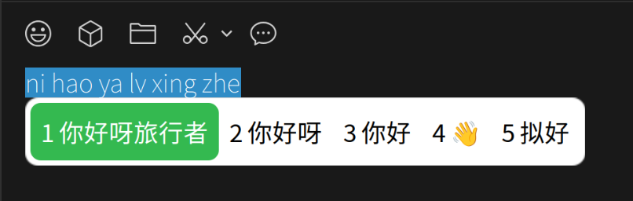
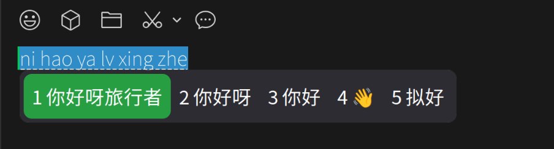

# Fcitx5 WeChat Theme

WeChat-style input method themes for [Fcitx5](https://github.com/fcitx/fcitx5), with a rime-ice memory patch and a ready-to-install `.deb` package.

 

## Features

- **Two SVG vector themes**: `wechat-light` (white, bright green highlight) and `wechat-dark` (translucent dark, muted green highlight).
- **True rounded corners**: rendered with SVG + nine-patch stretching, so the corners keep their radius no matter how many candidates are shown.
- **WeChat-matched geometry**: outer radius 10px, highlight radius 8px, 4/6px inner padding, 14px candidate text.
- **Rime memory patch**: speeds up dynamic frequency tuning so repeated words rise in the candidate list.
- **GNOME dark-mode switcher**: auto-switches between light/dark based on `org.gnome.desktop.interface color-scheme`.

## Requirements

SVG rendering needs fcitx5 classicui built with librsvg:

- fcitx5 **>= 5.1.22** (distro builds here).
- Ubuntu 26.04 ships fcitx5 **5.1.19** without SVG support — build from source, see [Build from source](#build-from-source).

## Installation

> **Ubuntu 26.04 users need full SVG rounded corners.** The distro's
> fcitx5 (5.1.19) has no SVG support, so follow **Step 1** below first to
> install the prebuilt SVG fcitx5 (5.1.22), then **Step 2** to install the
> theme. On distros that ship fcitx5 >= 5.1.22 (Arch, Fedora, ...), skip
> Step 1 and go straight to Step 2.

### Step 1 — Install the prebuilt SVG fcitx5 (Ubuntu 26.04 / x86_64)

Download `fcitx5-svg-5.1.22-linux-x86_64.tar.gz` from the [Releases](https://github.com/) page, then run:

```bash
bash install-fcitx5-svg.sh ./fcitx5-svg-5.1.22-linux-x86_64.tar.gz
```

The script installs the apt base libraries, extracts the tarball, copies the
fcitx5 binaries/libraries/data to `/usr`, and refreshes the linker cache.

Verify SVG support:

```bash
ldd /usr/lib/x86_64-linux-gnu/fcitx5/libclassicui.so | grep librsvg
```

> To build this tarball yourself on a machine that already compiled fcitx5
> from source, run `bash package-fcitx5.sh`.

### Option A — .deb package (Step 2, install the theme)

Download `fcitx5-wechat-theme_1.1.1_amd64.deb` from the [Releases](https://github.com/) page, then:

```bash
sudo apt install ./fcitx5-wechat-theme_1.1.1_amd64.deb
```

The package installs both themes to `/usr/share/fcitx5/themes/`, sets `Theme=wechat-light` in `classicui.conf`, and restarts fcitx5.

To build the package yourself:

```bash
bash build-deb.sh        # → dist/fcitx5-wechat-theme_<ver>_amd64.deb
```

### Option B — script (user-level)

```bash
bash install.sh
```

Installs the themes to `~/.local/share/fcitx5/themes/`, the rime patch to `~/.local/share/fcitx5/rime/`, and restarts fcitx5.

To switch themes, edit `Theme=` in `~/.config/fcitx5/conf/classicui.conf` (`wechat-light` / `wechat-dark`).

## Build from source

Shipping fcitx5 on Ubuntu 26.04 lacks SVG support. To get vector rounded corners, compile fcitx5 master:

```bash
sudo apt install -y build-essential cmake ninja-build extra-cmake-modules \
  librsvg2-dev libxcb-imdkit-dev libxcb-randr0-dev libxkbfile-dev \
  libgirepository1.0-dev libgtk2.0-dev libgtk-3-dev libcairo2-dev \
  libwayland-dev wayland-protocols plasma-wayland-protocols \
  qtbase5-private-dev qt6-base-private-dev libdbus-1-dev

git clone --depth=1 https://github.com/fcitx/fcitx5 && cd fcitx5
git submodule update --init --recursive          # required (yoga, etc.)
cmake -B build -G Ninja -DCMAKE_INSTALL_PREFIX=/usr -DCMAKE_BUILD_TYPE=Release -DENABLE_TEST=OFF
cmake --build build -j"$(nproc)" && sudo cmake --install build

# Rime engine (needed for rime-ice)
cd .. && git clone --depth=1 https://github.com/fcitx/fcitx5-rime && cd fcitx5-rime
cmake -B build -G Ninja -DCMAKE_INSTALL_PREFIX=/usr -DCMAKE_BUILD_TYPE=Release
cmake --build build -j"$(nproc)" && sudo cmake --install build

# GTK / QT frontends (candidate positioning)
cd .. && git clone --depth=1 https://github.com/fcitx/fcitx5-gtk && cd fcitx5-gtk
cmake -B build -G Ninja -DCMAKE_INSTALL_PREFIX=/usr -DCMAKE_BUILD_TYPE=Release
cmake --build build -j"$(nproc)" && sudo cmake --install build

cd .. && git clone --depth=1 https://github.com/fcitx/fcitx5-qt && cd fcitx5-qt
cmake -B build -G Ninja -DCMAKE_INSTALL_PREFIX=/usr -DCMAKE_BUILD_TYPE=Release
cmake --build build -j"$(nproc)" && sudo cmake --install build

sudo ldconfig
```

Verify SVG support:

```bash
ldd /usr/lib/x86_64-linux-gnu/fcitx5/libclassicui.so | grep librsvg
```

> Building over an `apt`-managed fcitx5 overwrites its files. Keep a system snapshot (e.g. `sudo timeshift --create`) before proceeding.

## Project structure

```
fcitx5-wechat-theme/
├── install.sh              # User-level installer (themes + rime patch)
├── install-fcitx5-svg.sh   # Installs the prebuilt SVG fcitx5 tarball
├── build-deb.sh            # Builds the .deb package
├── package-fcitx5.sh       # Builds the fcitx5-svg tarball
├── theme-switcher.sh       # GNOME dark-mode auto switcher
├── fcitx5/
│   ├── themes/
│   │   ├── wechat-light/   # theme.conf + panel.svg + highlight.svg
│   │   └── wechat-dark/
│   └── rime_ice.custom.yaml
├── screenshots/            # Preview images
└── dist/                   # build outputs (.deb + .tar.gz, gitignored)
```

## Customization (DIY)

The theme is **designed for 14px candidate text**. If you change the font size
in `classicui.conf`, the corner radius and padding no longer match — you must
re-render the SVGs to stay in proportion (see the geometry table below).

```ini
# ~/.config/fcitx5/conf/classicui.conf
Font="Noto Sans CJK SC 14"     # ← change the trailing number to resize
```

Change the font size, then edit the two SVGs (`panel.svg`, `highlight.svg`)
and the matching margins in `theme.conf`. Keep **rx == Margin** on each layer
so the nine-patch keeps the corner radius; otherwise corners get clipped.

### Geometry reference (14px design)

| Layer | File / setting | Size | Corner `rx` | Note |
|-------|----------------|------|-------------|------|
| Panel (outer) | `panel.svg` / `Background/Margin` | 320 × 54 | `rx=10` | white (light) / translucent dark |
| Inner spacing | `ContentMargin` | — | — | left/right 4px, top/bottom 6px |
| Highlight block | `highlight.svg` / `Highlight/Margin` | 120 × 40 | `rx=8` | corner radius on candidates |
| Text | `TextMargin` / `Font` | — | — | 14px |

> `rx` must equal the corresponding `Margin` (e.g. panel `rx=10` ↔
> `Background/Margin=10`, highlight `rx=8` ↔ `Highlight/Margin=8`). The
> nine-patch keeps the four corners fixed; only the middle stretches, so the
> radius survives any number of candidates. If the highlight block looks
> cramped or loses its roundness, raise/lower `rx` and its margin together.

DIY recipe (e.g. make the highlight taller): add the same value to
`highlight.svg`'s rect `height`, its `ry`, and `Highlight/Margin`'s
top/bottom — then run `fcitx5 -r -d` to reload.

## Credits

- Packaging reference: [Debian Policy Manual](https://www.debian.org/doc/debian-policy/ch-binary.html), [Debian HowToPackage](https://wiki.debian.org/HowToPackageForDebian)
- Upstream: [fcitx5](https://github.com/fcitx/fcitx5), [fcitx5-rime](https://github.com/fcitx/fcitx5-rime), [fcitx5-gtk](https://github.com/fcitx/fcitx5-gtk), [fcitx5-qt](https://github.com/fcitx/fcitx5-qt), [fcitx5-chinese-addons](https://github.com/fcitx/fcitx5-chinese-addons)
- UI inspiration: [nobodysclown/rime-wechat-keyboard](https://github.com/nobodysclown/rime-wechat-keyboard), [rime-ice](https://github.com/iDvel/rime-ice)

## License

[MIT](LICENSE). Copyright (c) 2026.
